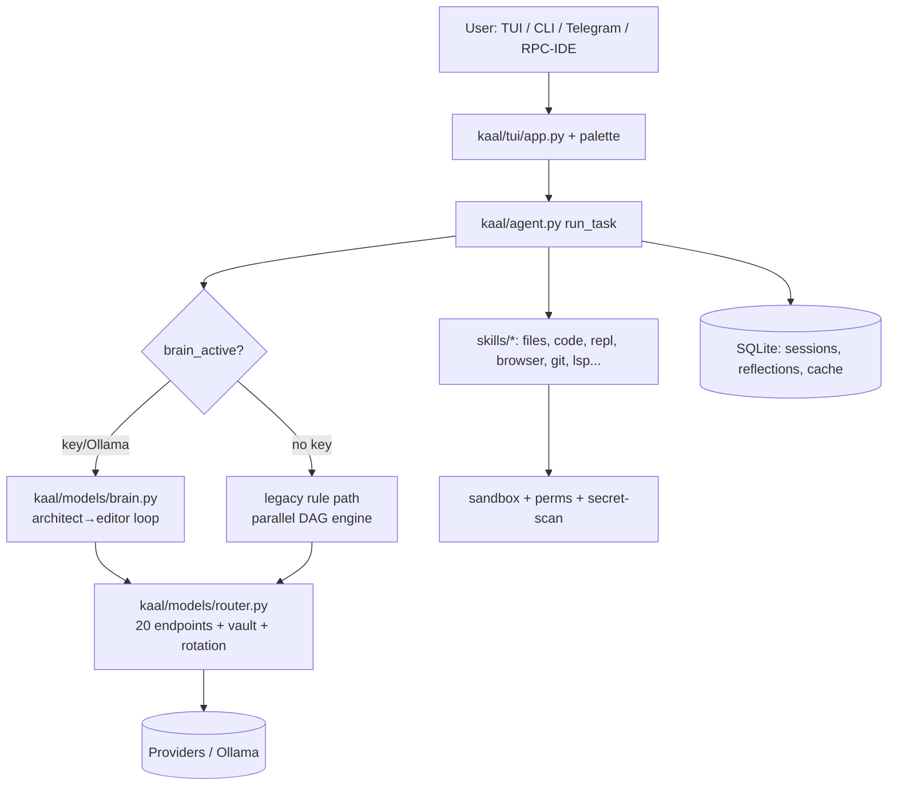

# Kaal Architecture

## Layers
| Layer | Dir | Rule |
|---|---|---|
| Entry | `kaal/__main__.py`, `kaal/tui/` | UI only, no logic |
| Agent | `kaal/agent.py`, `kaal/agents/`, `kaal/parallel.py` | orchestration, no direct API calls |
| Models | `kaal/models/` | all LLM traffic, rotation, budget |
| Skills | `kaal/skills/` | tools; new skill = 1 file + `SKILL` dict (see CONTRIBUTING) |
| Memory | `kaal/memory/`, `memory/*.db` | SQLite only, auto-cleanup |
| Config | `config/*.example.json` | secrets never committed |

## Data flow (one task)
1. `decompose` → todos (+roles) → permission gate → brain/legacy.
2. Every tool call → trace.jsonl observation (512KB rotation).
3. End → memory save + pattern learn + reflection hook + budget track.

## Platform gating
`kaal/platform_adapt.py` — static MATRIX + live binary probes.
Termux = light (concurrency 1, index cap 60, no docker/LSP-server);
PC = full where binaries exist. See `/platform`.
